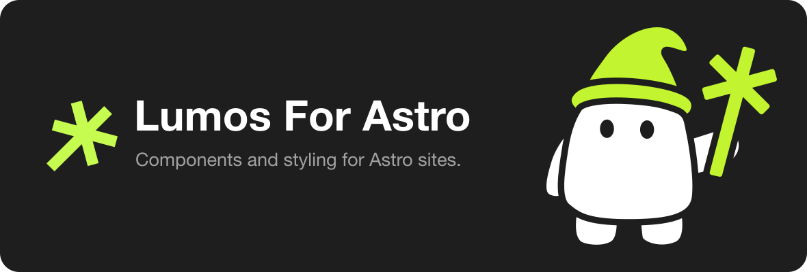

<p align="center">
  
</p>

<p align="center">
  <a href="https://www.npmjs.com/package/create-lumos"></a>
  <a href="LICENSE"></a>
  <a href="https://github.com/lumosframework/lumos-for-astro/actions/workflows/ci.yml"></a>
</p>

A component and styling framework for building Astro sites, designed around
efficiency, scalability and accessibility.

Documentation lives at **[lumosframework.com](https://lumosframework.com)**.

> **Beta.** `v0.0.1` is the first tagged release. The component API is still
> settling, so expect prop names to move before `v0.1.0`.

## Getting started

```sh
npm create lumos@latest my-site
```

That scaffolds a new site from this repository and installs its dependencies
with whichever package manager you ran it with. Then:

```sh
cd my-site
npm run dev
```

| Script            | What it does                      |
| ----------------- | --------------------------------- |
| `npm run dev`     | Starts the dev server             |
| `npm run build`   | Builds the site to `dist/`        |
| `npm run preview` | Serves the built site             |
| `npm run check`   | Type-checks every `.astro` file   |
| `npm run format`  | Formats the project with Prettier |

Node 22.12 or newer is required.

## How it is put together

### The cascade

Styles are split across four cascade layers, declared in
[`global.css`](src/styles/global.css) in this order:

| Layer        | File                                      | Holds                                               |
| ------------ | ----------------------------------------- | --------------------------------------------------- |
| `base`       | [base.css](src/styles/base.css)           | Design tokens, color themes, the reset, text styles |
| `patterns`   | [patterns.css](src/styles/patterns.css)   | Multi-property patterns shared across components    |
| `components` | Each component's own `<style>` block      | The component itself                                |
| `utilities`  | [utilities.css](src/styles/utilities.css) | Single-property classes                             |

A later layer beats an earlier one whatever the selectors say, so components
override patterns and utilities override components.

### Theming

Four theme classes — `theme-light`, `theme-dark`, `theme-brand` and
`theme-invert` — each redeclare the same set of custom properties, so anything
inside them picks up the right colors without knowing where it sits. `Section`,
`BaseLayout` and `Card` all take a `theme` prop that applies one.

### Components

Layout: `Section`, `ContentWrapper`, `Grid`, `ButtonWrapper`
Content: `Heading`, `Paragraph`, `RichText`, `Eyebrow`, `Card`, `Button`
Media: `Img`, `Video`, `Icon`, `Overlay`
Chrome: `Nav`, `Footer`, `SkipLink`, `BaseHead`, `FormattedDate`

Every component takes a `render` prop; pass `false` to skip it and its children.
Components that would render nothing skip themselves.

See [example-components](src/pages/example-components.astro) for each one in
context.

### Site configuration

Site name, description, canonical origin, locale and the routes kept out of
search live in [`src/consts.ts`](src/consts.ts).

## Documentation

Component reference, styling guides and examples are at
[lumosframework.com](https://lumosframework.com). This README covers the shape of the
framework; the site covers how to build with it.

## Contributing

Read
[CONTRIBUTING.md](https://github.com/lumosframework/lumos-for-astro/blob/main/CONTRIBUTING.md)
first — a pull request needs the
[CLA](https://github.com/lumosframework/lumos-for-astro/blob/main/CLA.md)
signed before it can be merged.

## License

[MIT](LICENSE)
